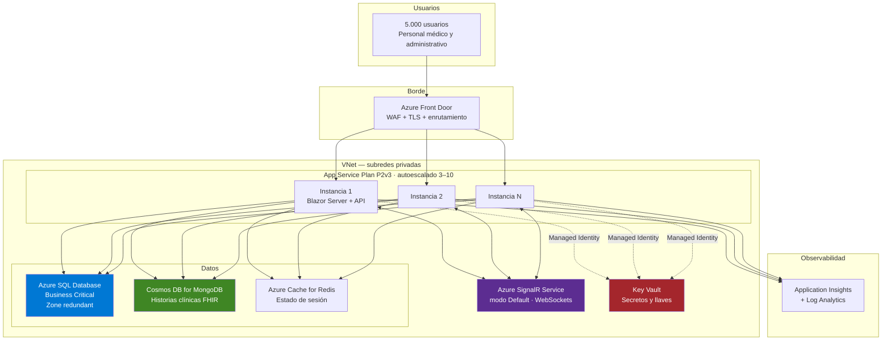

# Parte 1 — Arquitectura en Microsoft Azure

Módulo de admisiones para una EPS: 5.000 usuarios recurrentes en tiempo real sobre Blazor Server,
payload clínico FHIR/HL7 hacia un almacén documental y registro transaccional de copago hacia SQL.

## Diagrama



Todo el tráfico entre el App Service y los almacenes de datos va por **Private Endpoints** dentro
de la VNet: ni SQL ni Cosmos exponen endpoint público. Es un requisito, no una mejora opcional,
cuando se manejan datos clínicos.

---

## Pregunta 1 — Escalamiento horizontal de Blazor Server sin perder estado ni agotar sockets

Blazor Server mantiene un **circuito** por pestaña: una conexión WebSocket persistente más un árbol
de render vivo en la memoria del servidor. Eso rompe dos supuestos del escalado web tradicional.

### a) Descargar los WebSockets a Azure SignalR Service

Es la medida de mayor impacto. Un App Service tiene un límite duro de conexiones simultáneas por
instancia (unas 350 en planes básicos, varios miles en Premium v3), y cada usuario de Blazor Server
consume una de forma permanente, no por ráfagas.

Con **Azure SignalR Service en modo Default**, el App Service delega las conexiones al servicio
gestionado: cada instancia mantiene unas pocas conexiones servidor-a-servicio en lugar de miles de
conexiones cliente. El plan Standard escala a 1.000 conexiones por unidad y hasta 100 unidades, de
sobra para 5.000 usuarios con margen de picos.

Beneficio adicional: **elimina la necesidad de afinidad de sesión**. El servicio enruta los mensajes
al servidor que aloja el circuito, así que se puede escalar y reciclar instancias sin romper sesiones.

```csharp
builder.Services
    .AddRazorComponents()
    .AddInteractiveServerComponents()
    .AddHubOptions(options => { /* ... */ });

builder.Services.AddSignalR().AddAzureSignalR(/* cadena desde Key Vault */);
```

### b) Si no se usa Azure SignalR: sesiones pegajosas obligatorias

Sin el servicio, hay que dejar **ARR Affinity activado** en el App Service. El circuito vive en la
memoria de una instancia concreta; si el balanceador manda la siguiente petición a otra, el usuario
recibe "se perdió la conexión".

Es la opción inferior: la afinidad desbalancea la carga (una instancia recién agregada no recibe
usuarios existentes) y convierte cada reinicio en una desconexión masiva.

### c) No guardar estado en el circuito

Regla de diseño más que de infraestructura: **todo lo que deba sobrevivir a una reconexión va a un
almacén externo**, en este caso Azure Cache for Redis. Los campos del componente son caché volátil,
no fuente de verdad.

En este repositorio el dashboard aplica exactamente eso: en `OnInitializedAsync` rehidrata su estado
desde `IAdmisionesQuery` en lugar de asumir que sigue teniendo lo de antes.

### d) Acotar la memoria por circuito

Cada circuito desconectado que se retiene ocupa RAM. Los límites configurados en `Program.cs`:

```csharp
options.DisconnectedCircuitMaxRetained = 100;
options.DisconnectedCircuitRetentionPeriod = TimeSpan.FromMinutes(2);
options.MaxBufferedUnacknowledgedRenderBatches = 10;
```

El tercero es contrapresión: si un cliente con red mala no confirma los batches, el servidor deja de
encolar en lugar de crecer sin límite. Sin él, unos pocos clientes lentos pueden tumbar la instancia.

Complemento a nivel de componente: la lista del dashboard está acotada a 50 filas. Con 5.000
auditores conectados, una lista sin cota multiplica cualquier descuido por 5.000.

### e) Autoescalado por la métrica correcta

Escalar por CPU es engañoso en Blazor Server: el cuello de botella suele ser **memoria y conexiones**,
no cómputo. Las reglas se definen sobre memoria (> 70 %) y conexiones activas, con `scale-in`
conservador —cada instancia retirada desconecta a sus usuarios—.

### f) Health checks y despliegue sin cortes

`/health` alimenta las sondas del App Service. Los despliegues usan **slots con intercambio**, y el
período de reintento de conexión de Blazor cubre el corte breve del swap.

---

## Pregunta 2 — Almacenamiento seguro de cadenas de conexión (HIPAA / Habeas Data)

### Regla base: cero secretos en el repositorio y cero secretos en texto plano

En este proyecto, `appsettings.json` deja `ConnectionStrings:SqlServer` y `Mongo:ConnectionString`
**vacíos**. Solo `appsettings.Development.json` contiene credenciales, y son de contenedores locales
descartables que no existen fuera de la máquina del desarrollador.

### Producción: Managed Identity + Key Vault, sin contraseñas

La solución preferida es **eliminar el secreto**, no esconderlo mejor:

1. El App Service tiene una **System-Assigned Managed Identity**.
2. Azure SQL acepta autenticación Entra ID: la aplicación se conecta con
   `Server=...;Authentication=Active Directory Default;` y **no hay contraseña que rotar ni filtrar**.
3. Lo que sí es secreto irreducible —la cadena de Cosmos DB, que usa clave— vive en **Azure Key Vault**
   y se referencia desde la configuración del App Service:

   ```
   Mongo__ConnectionString = @Microsoft.KeyVault(SecretUri=https://kv-eps.vault.azure.net/secrets/mongo-conn/)
   ```

   La plataforma resuelve la referencia al arrancar usando la Managed Identity. El secreto nunca
   aparece en el portal, ni en el repositorio, ni en una variable de entorno legible.

4. Acceso al Key Vault por **RBAC** (`Key Vault Secrets User`), con acceso de red restringido a la
   VNet mediante Private Endpoint.

### Controles complementarios exigidos por normativa

| Control | Implementación |
|---|---|
| Cifrado en reposo | TDE en Azure SQL (por defecto); cifrado de servicio en Cosmos DB. Opcionalmente CMK con llaves en Key Vault |
| Cifrado en tránsito | TLS 1.2+ obligatorio; `Encrypt=True` en la cadena de SQL; HSTS activo |
| Datos sensibles a nivel de columna | **Always Encrypted** sobre `NumeroDocumento` si la clasificación lo exige: SQL Server nunca ve el texto plano |
| Auditoría de accesos | Azure SQL Auditing y Cosmos DB diagnostic logs hacia Log Analytics, con retención acorde a la normativa |
| Rotación | Rotación automática de las claves de Cosmos vía Event Grid + Key Vault |
| Superficie de red | Private Endpoints; `Public network access = Disabled` en ambos almacenes |
| Trazabilidad clínica | Los logs registran identificadores de admisión, **nunca** contenido de la historia clínica |

### Desarrollo local

`dotnet user-secrets` (fuera del árbol del repositorio) o `appsettings.Development.json` con
credenciales de contenedores efímeros. `.gitignore` excluye explícitamente `appsettings.*.local.json`
y archivos `.env`.

---

## Pregunta 3 — Caída temporal de SQL Server de 5 segundos sin perder la admisión

Se aplican tres capas independientes. La clave es que cada una cubre un modo de fallo distinto.

### Capa 1 — Reintentos automáticos en el proveedor (cubre el caso descrito)

Una caída de ~5 segundos es exactamente un **fallo transitorio**: failover de Azure SQL, reconfiguración
de la réplica o *throttling*. EF Core lo resuelve sin código adicional:

```csharp
sql.EnableRetryOnFailure(
    maxRetryCount: 5,
    maxRetryDelay: TimeSpan.FromSeconds(10),
    errorNumbersToAdd: null);
```

`SqlServerRetryingExecutionStrategy` conoce la lista de códigos de error transitorios de Azure SQL
(40613, 40197, 49918, 10928…) y reintenta con backoff exponencial. Una interrupción de 5 segundos se
absorbe dentro de la ventana de reintentos: la petición tarda más, pero **la admisión se completa**.

Consecuencia de diseño: con una execution strategy activa no se pueden abrir transacciones explícitas
de forma ingenua. Por eso `UnitOfWork` se apoya en la transacción implícita de `SaveChangesAsync`
—ver el comentario en la clase—.

### Capa 2 — El patrón Outbox elimina la ventana de inconsistencia

Aquí está la decisión arquitectónica de fondo, y responde a la vez a la Parte 2.

El enunciado plantea: escribir en Mongo y después en SQL, con riesgo de que Mongo tenga éxito y SQL
falle. **Se invierte el orden**:

1. **Una sola transacción en SQL Server** escribe, atómicamente: paciente, atención facturable,
   admisión con el copago bloqueado y el mensaje de Outbox con el payload FHIR completo.
2. Un `BackgroundService` lee el Outbox y materializa la historia clínica en Cosmos DB con **upsert
   idempotente** por `_id`, protegido con Polly.

Con esto, el escenario "Mongo OK pero SQL falla" **deja de existir por construcción**: ya no hay dos
escrituras remotas que puedan divergir. Si SQL falla, no se admitió a nadie y el cliente recibe error.
Si SQL tiene éxito, la admisión está garantizada y Mongo converge.

No se usan transacciones distribuidas (MSDTC) porque **Azure SQL no las soporta** entre motores
heterogéneos, y aunque las soportara, un 2PC sobre dos almacenes distintos es un acoplamiento de
disponibilidad: la caída de cualquiera de los dos tumbaría las admisiones.

### Capa 3 — Idempotencia de extremo a extremo

Si el fallo ocurre **después** del commit pero antes de que la respuesta llegue al cliente, el cliente
reintentará. La cabecera `Idempotency-Key` hace que el reintento devuelva la admisión original en
lugar de duplicar el copago —cobrar dos veces a un afiliado es un incidente regulatorio, no un bug menor—.

### Si la caída fuera prolongada, no transitoria

Los reintentos de EF Core no cubren una indisponibilidad de minutos. Para ese escenario:

- **Amortiguar en el borde**: la API encola la solicitud en Azure Service Bus y responde `202 Accepted`
  con la URL de seguimiento. La admisión se procesa cuando SQL vuelve. Nada se pierde y el personal
  médico no queda bloqueado.
- **Alta disponibilidad del motor**: Azure SQL Business Critical con redundancia de zona ofrece
  failover automático en segundos y un SLA de 99,995 %.
- **Circuit breaker** hacia SQL para dejar de martillar un servicio caído y degradar de forma
  controlada en lugar de acumular timeouts.

### Observabilidad de la consistencia

`EstadoAdmision` (`PendienteSincronizacion` → `Sincronizada` | `FallidaSincronizacion`) hace que la
consistencia eventual sea **medible**, no un acto de fe. Una alerta sobre admisiones pendientes por
más de N minutos detecta el problema antes de que lo reporte auditoría.
